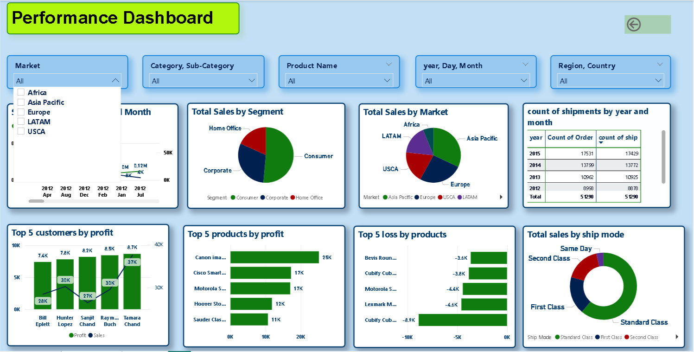

# 📊 Superstore Sales Data Analysis

## Overview

This project presents an interactive Power BI dashboard analyzing global superstore sales data. It offers insights into sales performance, profitability, customer segments, and shipping preferences, aiding strategic decision-making.

## Dataset

- **Source**: `global_superstore_2016.xlsx`
- **Contents**: Includes order details, customer information, product categories, sales figures, profits, discounts, and shipping data.

## Dashboard Highlights

### 🏠 Homepage

- **Key Metrics**: Total Sales, Profit, Quantity Sold, Average Discount.
- **Visuals**: Sales by Category, Sales by Region, Top-Selling Products.

### 📈 Performance Page

- **Trend Analysis**: Monthly Sales and Profit Trends.
- **Customer Insights**: Segment-wise Sales and Profit.
- **Shipping Analysis**: Preferred Shipping Modes and their impact on sales.

